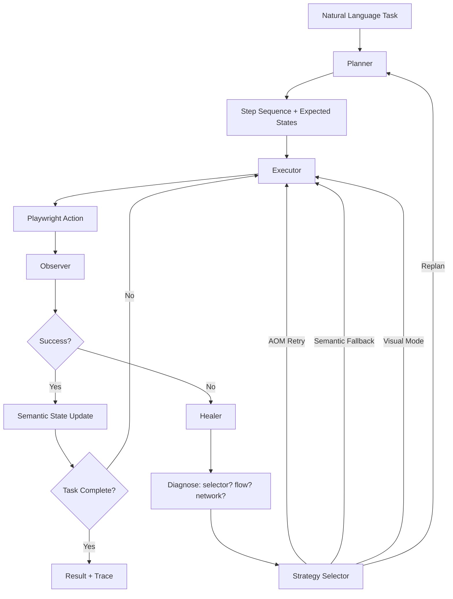

# Signal-Foundry: Full Implementation Plan

> Three AI systems demonstrating evaluation-first harness engineering: Claude Skills for CI/CD, a self-healing browser automation agent, and a hybrid SEC 10-K extraction pipeline.

---

## User Review Required

> [!IMPORTANT]
> **API Keys & Services Needed** — Before I begin implementation, please provide:
> 1. **OpenRouter API Key** — for LLM calls (supports all requested models: GPT-5.5, Claude Opus 4.7, Gemini 3.1 Pro, etc.)
> 2. **GitHub Personal Access Token** (fine-grained, `repo:read` + `actions:read` scope) — for Task 1 CI/CD Skills demo
> 3. **Zeabur account** — I'll need you to connect the GitHub repo for deployment; I'll provide `zbpack.json` configs
> 4. **LangSmith API Key** (optional but recommended) — for tracing & eval dashboards

> [!WARNING]
> **System Dependencies** — I'll need `sudo` to install:
> - Playwright system browsers: `playwright install --with-deps chromium`
> - Any missing system packages for headless Chrome on Zeabur (handled via `Dockerfile`)

## Open Questions

> [!IMPORTANT]
> 1. **Do you already have an OpenRouter account?** All LLM model switching (GPT-5.5, Claude Opus 4.7, Gemini, DeepSeek, etc.) will go through OpenRouter as the unified gateway. If you also want NVIDIA AI Endpoints as a fallback, please confirm.
> 2. **Zeabur plan tier?** Free tier limits may affect concurrent services. We need 3 services (one per task) or 1 unified service. I recommend **1 unified FastAPI service** with sub-routes to stay within limits.
> 3. **Should the demo be English-only UI, or bilingual (EN/ZH)?** I'll default to English with Chinese annotations in docs.
> 4. **For Task 1 demo: do you have a specific public repo** we should test against, or shall I use this repo itself + a few well-known open-source repos?

---

## Architecture Overview

```
signal-foundry/                     ← monorepo root
├── CLAUDE.md                       ← Project brain (auto-loaded by Claude Code)
├── CLAUDE.local.md                 ← Personal overrides (gitignored)
├── AGENTS.md                       ← Agent instructions (Codex/agent-facing)
├── PLANS.md                        ← Execution plan template
├── code_review.md                  ← Review guidelines for agents
├── README.md                       ← Human-facing: arch diagram, tradeoffs, how-to
│
├── .claude/
│   ├── settings.json               ← Permissions & hooks
│   └── skills/                     ← Claude Skills (Task 1 deliverables)
│       ├── lint-and-test/
│       │   └── SKILL.md
│       ├── build-and-release/
│       │   └── SKILL.md
│       ├── dependency-audit/
│       │   └── SKILL.md
│       └── security-scan/
│           └── SKILL.md
│
├── src/                            ← Main Python package
│   ├── __init__.py
│   ├── config.py                   ← Shared config (env vars, model registry)
│   ├── llm_provider.py             ← Unified LLM factory (OpenRouter + NVIDIA)
│   ├── main.py                     ← FastAPI app (unified entry point)
│   ├── shared/                     ← Shared harness infrastructure
│   │   ├── __init__.py
│   │   ├── harness.py              ← Base harness: retry, fallback, circuit breaker
│   │   ├── evaluator.py            ← Evaluation engine (LLM-as-judge + deterministic)
│   │   ├── cost_tracker.py         ← Token/cost/latency ledger
│   │   ├── logger.py               ← Structured logging + trace IDs
│   │   └── schemas.py              ← Shared Pydantic schemas
│   │
│   ├── task1_cicd/                 ← Task 1: CI/CD Skills Engine
│   │   ├── __init__.py
│   │   ├── router.py               ← FastAPI routes
│   │   ├── skill_engine.py         ← Skill orchestrator
│   │   ├── skill_registry.py       ← Skill discovery & matching
│   │   ├── github_client.py        ← GitHub API wrapper (rate-limited, auth)
│   │   ├── sandbox.py              ← Isolated execution environment
│   │   └── skills/                 ← Runtime skill definitions (JSON schemas)
│   │       ├── lint_and_test.py
│   │       ├── build_and_release.py
│   │       ├── dependency_audit.py
│   │       └── security_scan.py
│   │
│   ├── task2_browser/              ← Task 2: Browser Automation Agent
│   │   ├── __init__.py
│   │   ├── router.py               ← FastAPI routes
│   │   ├── agent.py                ← Main agent loop (Plan→Act→Observe→Reflect)
│   │   ├── planner.py              ← Task decomposition
│   │   ├── executor.py             ← Playwright action execution
│   │   ├── healer.py               ← Self-healing / self-correction
│   │   ├── state_tracker.py        ← Semantic state tracking
│   │   ├── locator_strategy.py     ← AOM→Semantic→Visual fallback
│   │   └── browser_tools.py        ← Playwright wrapper tools
│   │
│   └── task3_sec/                  ← Task 3: SEC 10-K Extraction
│       ├── __init__.py
│       ├── router.py               ← FastAPI routes
│       ├── pipeline.py             ← Main extraction pipeline
│       ├── fetcher.py              ← SEC EDGAR API client
│       ├── normalizer.py           ← HTML/text normalization
│       ├── rule_parser.py          ← Rule-based section detection
│       ├── llm_refiner.py          ← LLM boundary refinement
│       ├── validator.py            ← Post-validation (char_range, XBRL cross-check)
│       ├── xbrl_client.py          ← XBRL Company Facts API
│       └── schemas.py              ← 10-K item output schemas
│
├── evals/                          ← Evaluation sets & results
│   ├── task1/
│   │   ├── scenarios.json          ← CI/CD test scenarios
│   │   └── results/
│   ├── task2/
│   │   ├── eval_set.json           ← Browser task eval set (20+ cases)
│   │   └── results/
│   └── task3/
│       ├── eval_set.json           ← 10-K eval set (diverse filings)
│       ├── ground_truth/           ← Human-verified samples
│       └── results/
│
├── prompts/                        ← Prompt records (versioned)
│   ├── v1_initial/
│   ├── v2_refined/
│   ├── v3_production/
│   ├── skill_design.md
│   ├── agent_planning.md
│   ├── failure_analysis.md
│   └── eval_design.md
│
├── templates/                      ← Jinja2 HTML templates for Web UI
│   ├── base.html
│   ├── index.html                  ← Dashboard
│   ├── task1.html                  ← Skills Runner UI
│   ├── task2.html                  ← Browser Agent UI
│   └── task3.html                  ← SEC Analyzer UI
│
├── static/                         ← CSS, JS assets
│
├── tests/                          ← Unit + integration tests
│   ├── test_task1/
│   ├── test_task2/
│   └── test_task3/
│
├── notes/                          ← (existing) Design notes
├── Dockerfile                      ← Production container
├── docker-compose.yml              ← Local dev
├── requirements.txt                ← Dependencies
├── pyproject.toml                  ← Project metadata
├── zbpack.json                     ← Zeabur deployment config
└── .env.example                    ← Environment variable template
```

---

## Proposed Changes

### Shared Infrastructure

#### [NEW] [config.py](file:///mnt/c/Users/leoqa/Documents/signal-foundry/src/config.py)
Unified configuration management:
- Model registry with dropdown support: `openai/gpt-5.5`, `anthropic/claude-opus-4.7`, `google/gemini-3.1-pro-preview`, `moonshotai/kimi-k2.6`, `z-ai/glm-5.1`, `deepseek-ai/deepseek-v4-pro`, `minimaxai/minimax-m2.7`
- Environment variable loading via `pydantic-settings`
- SEC API configuration (User-Agent header, rate limits)
- Cost thresholds and circuit breaker parameters

#### [NEW] [llm_provider.py](file:///mnt/c/Users/leoqa/Documents/signal-foundry/src/llm_provider.py)
Unified LLM factory with switchable backends:
```python
def get_llm(model_name: str) -> BaseChatModel:
    # Routes to langchain-openrouter or langchain-nvidia-ai-endpoints
    # Supports all 7+ models via dropdown selection
    # Includes fallback chain: primary → secondary → local
```

#### [NEW] [harness.py](file:///mnt/c/Users/leoqa/Documents/signal-foundry/src/shared/harness.py)
Three-layer fault tolerance:
1. **Fast-fail** — input validation, schema checks
2. **Retry with backoff** — transient errors, rate limits
3. **Strategy replacement** — fallback to alternative approach

Plus: circuit breaker, execution ID tracking, structured logging per step.

#### [NEW] [evaluator.py](file:///mnt/c/Users/leoqa/Documents/signal-foundry/src/shared/evaluator.py)
Unified evaluation engine:
- Deterministic checks (exit codes, schema validity, char_range matching)
- LLM-as-judge with configurable rubrics
- Automatic failure taxonomy generation
- Metric aggregation (success_rate, latency_p50/p95, cost_per_call)

#### [NEW] [cost_tracker.py](file:///mnt/c/Users/leoqa/Documents/signal-foundry/src/shared/cost_tracker.py)
Token/cost/latency ledger exposed as `/metrics` endpoint:
- Per-request: tokens_in, tokens_out, llm_calls, execution_time, total_cost
- Per-task: aggregated daily/weekly stats
- Budget alerts and auto-throttle

#### [NEW] [main.py](file:///mnt/c/Users/leoqa/Documents/signal-foundry/src/main.py)
Unified FastAPI app with:
- Dashboard at `/` (links to all 3 task UIs)
- Task 1 routes at `/api/v1/skills/...`
- Task 2 routes at `/api/v1/browser/...`
- Task 3 routes at `/api/v1/sec/...`
- Health check at `/health`
- Metrics at `/metrics`
- Model selection dropdown support via `/api/v1/models`

---

### Task 1: GitHub CI/CD as Claude Skills

#### Design Philosophy
Skills are **structured interfaces** — not raw bash commands. Each skill has:
- **JSON Schema** for inputs/outputs
- **Dry-run mode** (always first, human confirms before apply)
- **Idempotency** via commit SHA cache keys
- **Security boundary** via blocklist (no force push, no prod deploy, no IAM changes)

#### Skills to Implement

| Skill | Trigger Phrases | Input | Output | Scope |
|-------|----------------|-------|--------|-------|
| `lint-and-test` | "test this", "run tests", "check code quality" | repo_url, branch, config | report (pass/fail per check, timing) | read-only |
| `build-and-release` | "release", "deploy", "ship it" | repo_url, tag, dry_run | artifact URL, changelog | read → dry-run → gated write |
| `dependency-audit` | "audit deps", "check vulnerabilities" | repo_url, severity_threshold | vulnerability list, remediation | read-only |
| `security-scan` | "scan for secrets", "SAST", "check CVEs" | repo_url, scan_type | findings, severity, location | read-only |

#### [NEW] `.claude/skills/lint-and-test/SKILL.md`
```yaml
---
name: lint-and-test
description: >
  Runs linting and test suites on a GitHub repository. Use when the user asks
  to "test this repo", "run tests", "check code quality", "lint", or "CI check".
  Supports Python (ruff, pytest), JavaScript (eslint, jest), and generic Makefile targets.
---
```
Followed by detailed instructions, input/output schema, error handling, and examples.

#### Skill Engine Architecture
```
User Request → Skill Registry (semantic match) → Plan Mode (dry-run)
    → Human Approval → Sandbox Execution → Result + Audit Log
```

- **Skill Registry**: Loads all SKILL.md files, indexes by trigger phrases + description embedding. Uses cosine similarity for matching.
- **Sandbox**: Docker-based isolation. Skills execute in ephemeral containers with limited permissions.
- **Idempotency**: Check runs keyed by `{repo}:{commit_sha}:{skill_name}`.

#### Demo Web UI
- Input: repo URL + optional branch + skill selection dropdown
- Output: live execution trace, skill outputs, cost/timing, replay button
- Shows prompt used, LLM reasoning, and final artifacts

#### Eval Set (5-10 scenarios)
- Simple Python project (clean pass)
- Monorepo with multiple languages
- Project with known vulnerabilities
- Failing tests (should report correctly)
- Edge: empty repo, very large repo, private repo (auth test)

---

### Task 2: Generalized Browser Automation Agent

#### Architecture: Planner → Executor → Observer → Healer (PEOH Loop)



#### Locator Strategy (3-Layer Fallback)
1. **AOM (Accessibility Object Model)** — `page.get_by_role()`, `get_by_label()`, `get_by_text()` — most resilient to UI changes
2. **Semantic DOM** — `aria-label`, `data-testid`, semantic HTML elements
3. **Visual Mode** — Screenshot + Set-of-Mark (SoM) annotation → multimodal LLM identifies element by number

#### Self-Correction Mechanism
Not just `try/except` retry. Substantive diagnosis:
1. **Failure Classification**: selector_mismatch | page_load | logic_error | network | auth_required | captcha
2. **Root Cause Analysis**: DOM diff between expected and actual state
3. **Strategy Selection**: Based on failure type, choose different recovery path
4. **Confidence Score**: Each step produces 0-1 confidence. Below 0.6 triggers Healer.

#### Self-Maintenance
- **Dynamic Locator Resolution**: Store semantic descriptions ("login button with text 'Sign In'"), re-resolve at runtime
- **Site-Skill Memory**: Successful interaction patterns cached per domain for reuse
- **DOM Change Detection**: Hash-based comparison of critical page regions

#### Silent Failure Prevention
- **Intent Verification**: After each action, LLM checks screenshot → "Did this action achieve its intent?"
- **Success Signal Taxonomy**: Different action types have different success criteria:
  - Click → URL change OR DOM mutation
  - Form submit → Confirmation message OR redirect
  - Navigation → Target URL reached OR expected content visible
- **State Assertion**: Semantic state tracker maintains business-level state (e.g., `cart_has_items=true`)

#### Eval Set Design (20+ cases across 4 dimensions)

| Dimension | Examples |
|-----------|----------|
| **Domain diversity** | E-commerce (search+add to cart), News (find article), Wikipedia (search+extract), Google (search), Form sites |
| **Task complexity** | Single-step, multi-step, requires scrolling, requires waiting, pagination |
| **Failure injection** | Dynamic selectors, slow loading, pop-up dialogs, cookie banners |
| **Edge cases** | SPA routing, iframe, shadow DOM, infinite scroll, mobile viewport |

#### Honest Metrics
Will report:
- Overall success rate per domain and task type
- Self-healing resolution rate (~65% expected based on research)
- Cases requiring human intervention (~35%)
- Average latency per task
- LLM cost per task

---

### Task 3: SEC 10-K Item-level Structured Extraction

#### Pipeline Architecture (4-Stage Hybrid)

```
Input (CIK+accession or URL)
  │
  ▼
Stage 1: Rule-based Pre-segmentation ($0 cost, ~70% coverage)
  │  - HTML anchor scanning (<a name="item...">)
  │  - Table of Contents parsing
  │  - Regex heading detection
  │  - Format detection (HTML vs plain text)
  │
  ▼
Stage 2: LLM Boundary Refinement (only for low-confidence boundaries)
  │  - ±500 char context window around uncertain boundaries
  │  - Few-shot structured output (JSON mode)
  │  - Uses cheaper model first (e.g., DeepSeek)
  │
  ▼
Stage 3: Reflexive Validation (hierarchical + selective reflexion)
  │  - Only triggers for: incorporated_by_reference, not_applicable
  │  - LLM-as-judge checks extraction quality
  │  - char_range verification (indexOf match in source)
  │
  ▼
Stage 4: XBRL Cross-validation
  │  - Company Facts API comparison
  │  - Financial number spot-checks
  │  - Auto-flag discrepancies as needs_review
  │
  ▼
Output: Structured JSON
```

#### Output Schema
```json
{
  "filing_metadata": {
    "cik": "0000320193",
    "company_name": "Apple Inc.",
    "accession_number": "0000320193-23-000106",
    "filing_date": "2023-11-03",
    "fiscal_year_end": "2023-09-30"
  },
  "items": [
    {
      "part": "I",
      "item_number": "1",
      "item_title": "Business",
      "content_text": "Apple Inc. (\"Apple\") designs, manufactures...",
      "char_range": [12450, 45230],
      "status": "extracted",
      "confidence": 0.95,
      "extraction_method": "rule_based"
    },
    {
      "part": "III",
      "item_number": "10",
      "item_title": "Directors, Executive Officers and Corporate Governance",
      "content_text": "Information regarding directors and executive officers is incorporated by reference to the Proxy Statement...",
      "char_range": [198000, 198450],
      "status": "incorporated_by_reference",
      "reference_document": "DEF 14A",
      "reference_url": "https://www.sec.gov/Archives/edgar/data/..."
    }
  ],
  "processing_metadata": {
    "total_tokens_in": 12500,
    "total_tokens_out": 3200,
    "llm_calls": 3,
    "rule_only_items": 12,
    "llm_refined_items": 4,
    "total_cost_usd": 0.045,
    "total_latency_ms": 8500,
    "stages_used": ["rule_based", "llm_refine", "xbrl_cross_check"]
  }
}
```

#### Incorporated by Reference Handling
1. Detect pattern: "incorporated by reference from the Proxy Statement"
2. Query SEC Submissions API for same company/year DEF 14A
3. If found: status = `incorporated_and_resolved`, content extracted from proxy
4. If not found: status = `incorporated_by_reference`, content = original reference text

#### Eval Set Design (15+ filings)

| Category | Examples | Why |
|----------|----------|-----|
| **Modern large-cap** | Apple, Microsoft, Amazon (2023-2024) | Clean HTML, good anchors |
| **Modern small-cap** | Various small companies | Often messier formatting |
| **Old filings** | Pre-2005 plain text filings | No HTML structure |
| **Heavy incorporated** | Companies with Part III referencing proxy | Tests reference resolution |
| **Industry diversity** | Tech, Finance, Energy, Healthcare, Retail | Different section patterns |
| **Edge cases** | "Not Applicable" items, "Reserved" items | Status detection |

#### Cost Discipline
- Target: Most modern filings → rule-only ($0 LLM cost)
- Budget cap: Max $0.50 per filing
- Automatic fallback to cheaper models when primary exceeds threshold
- Caching of SEC API responses (in-memory + disk) to respect 10 req/sec

---

### Documentation Files

#### [NEW] [CLAUDE.md](file:///mnt/c/Users/leoqa/Documents/signal-foundry/CLAUDE.md)
Project brain (<200 lines): tech stack, build commands, conventions, architecture boundaries, red lines.

#### [NEW] [AGENTS.md](file:///mnt/c/Users/leoqa/Documents/signal-foundry/AGENTS.md)
Agent-facing instructions: repo layout, build/test/lint commands, engineering conventions, PR expectations, constraints, verification criteria.

#### [NEW] [PLANS.md](file:///mnt/c/Users/leoqa/Documents/signal-foundry/PLANS.md)
Execution plan template for multi-step tasks. Guides agents to decompose, verify, and iterate.

#### [NEW] [code_review.md](file:///mnt/c/Users/leoqa/Documents/signal-foundry/code_review.md)
Review guidelines: security checks, performance patterns, test requirements, error handling standards. References AGENTS.md for context.

#### [MODIFY] [README.md](file:///mnt/c/Users/leoqa/Documents/signal-foundry/README.md)
Complete rewrite with:
- Mermaid architecture diagram
- Design Trade-offs section (honest about what works and what doesn't)
- AI Collaboration Log
- How to Run (local + Zeabur URLs)
- Evaluation results summary
- "Why our design outperforms generic agents" section
- Future roadmap connecting to company's trading systems

#### [NEW] [architecture_design_spec.md](file:///mnt/c/Users/leoqa/Documents/signal-foundry/notes/progress/architecture_design_spec.md)
Full technical spec covering all sections requested in progress_notes item 5.

---

### Deployment

#### [NEW] [zbpack.json](file:///mnt/c/Users/leoqa/Documents/signal-foundry/zbpack.json)
```json
{
  "build_command": "pip install -r requirements.txt && playwright install chromium",
  "start_command": "uvicorn src.main:app --host 0.0.0.0 --port 8080"
}
```

#### [NEW] [Dockerfile](file:///mnt/c/Users/leoqa/Documents/signal-foundry/Dockerfile)
Multi-stage build with Playwright + Chrome for browser automation.

---

## Technology Stack

| Layer | Choice | Rationale |
|-------|--------|-----------|
| **Language** | Python 3.11+ | Team preference, LangChain ecosystem |
| **Agent Framework** | LangChain + LangGraph | Requested; harness engineering support |
| **LLM Gateway** | langchain-openrouter | Unified access to all 7+ models |
| **LLM Fallback** | langchain-nvidia-ai-endpoints | Secondary provider |
| **Browser** | Playwright | Zeabur-compatible, AOM support |
| **Web Framework** | FastAPI + Jinja2 | Async, OpenAPI docs, lightweight UI |
| **Validation** | Pydantic v2 | Strict schemas, structured output |
| **HTML Parsing** | BeautifulSoup4 + lxml | SEC filing parsing |
| **Tracing** | LangSmith (optional) | Observability |
| **Deployment** | Zeabur (zbpack) | Required by spec |
| **Container** | Docker | Sandbox + deployment |

---

## Innovation Differentiators (vs OpenClaw/HermesAgent)

1. **Harness > Model**: Domain-specific harness with failure taxonomy and recovery strategies per task, not generic tool loop
2. **AOM-first Locators**: Accessibility-based element finding > brittle CSS selectors
3. **Reflexive Architecture**: Selective self-validation loops with cost awareness (don't validate everything, only uncertain items)
4. **Semantic State Tracking**: Business-level state assertions prevent silent failures
5. **Cost Discipline**: Explicit cost ledger, tiered parsing (rules first, LLM only when needed), budget caps
6. **Context Engineering**: Structured context design (what goes in, what's excluded, why) vs monolithic prompts
7. **Reproducible Eval Framework**: Quantifiable reliability metrics, not "vibes-based" testing
8. **Trading System Connection**: Architecture designed to feed into event-driven trading notification systems

---

## Verification Plan

### Automated Tests
```bash
# Unit tests
pytest tests/ -v --cov=src --cov-report=html

# Task 1: Run skills against test repos
python -m evals.task1.run_eval

# Task 2: Run browser eval set
python -m evals.task2.run_eval

# Task 3: Run SEC extraction eval set
python -m evals.task3.run_eval

# Full eval report
python -m evals.generate_report
```

### Manual Verification
- Browser test: Manually verify 5 browser tasks with different websites
- SEC test: Manually spot-check 3 filings against actual 10-K text
- Skills test: Run all 4 skills against this repo
- Deploy to Zeabur and test all API endpoints
- Verify Web UI responsiveness and functionality

---

## Execution Priority

Based on the thoughts draft recommendation:
1. **Phase 0**: Repo skeleton + shared infrastructure + all documentation files ← **START HERE**
2. **Phase 1**: Task 3 (SEC 10-K) — clearest I/O spec, best for demonstrating systematic thinking
3. **Phase 2**: Task 2 (Browser Agent) — highest technical difficulty, but browser-use ecosystem helps
4. **Phase 3**: Task 1 (CI/CD Skills) — newest ecosystem, but best documented
5. **Phase 4**: Evaluation runs + polish + deployment

Each phase will have its own commits reflecting real iteration (not one big commit).


# Progress Notes
    1. 請先查看了解 @_JobDescription.md 相關background與搜尋理解公司需要的方向
    2. 接著查看此repo將要實作的三個項目之描述與目標預期 @_TaskDescription.md
    3. 我在@_ThoughtsDraft.md裡面撰寫了很多我目前最初步粗略的想法跟思考，裡面有很多references給你去進行web_search deep dive research用法，你不一定都要照著做只是給你初步的方向跟思考，你需要依據best practice與前述的兩份文件去考量，思考該怎麼把三個tasks都能夠完美依據@_TaskDescription.md需求來達到並進行設計與開發
    4. 創建此repo所有tasks所需要的架構skelton、目錄與檔案結構等等
    5. 統整所有你的research與上述所有文件並充分理解以後，請將你的具體開發方案、結構說明、實作plan、技術選型、實作思維邏輯、細節實踐方針、步驟階段、資料結構/schema、開發邊界、錯誤/例外處理、pipeline、API/SDK運用規劃、eval set如何設計與取得與創建、評估方式metrics、未來展望/進步方向/如何再改進優化等等所有事前準備思考資訊全部都撰寫成一份完整的說明文件於 @architecture_design_spec.md 當中
    6. 如果有什麼東西需要權限才能安裝(e.g., 需要sudo權限)，或是需要去哪個網站網址哪裡申請什麼東西(e.g., 創建api key, UI點選操作, 申請購買服務, 填寫網站表單, ...)，提供哪些資訊給你的部分(e.g., api key, 權杖, ...)，也都請跟我說，我可以幫忙處理
    7. 撰寫CLAUDE.md 文件沒有必需的格式，但要保持簡短和易於閱讀。CLAUDE.md 文件可以使用 @path/to/import 語法導入其他文件您可以將 CLAUDE.md 文件放在多個位置：主文件夾（~/.claude/CLAUDE.md）：適用於所有 Claude 會話、項目根目錄（./CLAUDE.md）：簽入 git 以與您的團隊共享、項目根目錄（./CLAUDE.local.md）：個人項目特定的筆記；將此文件添加到您的 .gitignore，以便不與您的團隊共享、父目錄：對於 monorepos 很有用，其中 root/CLAUDE.md 和 root/foo/CLAUDE.md 都會自動拉入、子目錄：當在這些目錄中的文件上工作時，Claude 按需拉入子 CLAUDE.md 文件。如果 Claude 應該始終知道它，請將其放在 CLAUDE.md 中：編碼約定、構建命令、專案結構、「永遠不要執行 X」規則。如果它是 Claude 有時需要的參考資料（API 文件、風格指南）或您使用 /<name> 觸發的工作流程（部署、審查、發佈），請將其放在 skill 中。保持 CLAUDE.md 在 200 行以下。如果它在增長，將參考內容移動到 skills 或拆分為 .claude/rules/ 檔案。使用 CLAUDE.md 用於每個會話需要的指令：構建命令、測試約定、專案架構。使用 rules 保持 CLAUDE.md 專注。具有 paths frontmatter 的 rules 僅在 Claude 使用匹配檔案時載入，節省上下文。使用 skills 用於 Claude 有時只需要的內容，如 API 文件或您使用 /<name> 觸發的部署檢查清單。
    8. 撰寫AGENTS.md指導agent何時使用該計劃。這是一種用於指導 Codex 等編碼代理的簡單格式。我們描述了一個使用者可以用作簡寫符號的術語，以及一條用於指導何時使用計劃文件的簡單規則。在這裡，我們稱之為「ExecPlan」。請注意，這是一個任意術語，Codex 尚未接受過相關訓練。當提示 Codex 指向計劃的特定定義時，可以使用此簡寫符號。您可以將其視為AGENTS.md面向代理的開放格式 README 文件。它會自動載入到上下文中，是您和您的團隊在程式碼庫中如何定義 Codex 工作方式的最佳場所。撰寫包含倉庫佈局和重要目錄、如何運行該項目、建置、測試和程式碼檢查命令、工程慣例和公關預期、約束和禁止規則、完成工作的含義以及如何驗證工作。根據需求best practice實際的建置、測試、審查和發布程式碼的方式對結果進行編輯。一個全域檔案AGENTS.md用於設定個人預設值（位於根目錄下）~/.codex，一個倉庫層級的檔案用於設定共用標準，以及子目錄中更具體的檔案用於設定本機規則。如果目前目錄附近有更具體的文件，則以該文件的規則為準。務必注重實用性。一份簡明扼要、準確無誤的AGENTS.md文件比一份充斥著模糊規則的長篇文件更有用。先從基礎入手，只有在發現反覆出現的錯誤後才加入新規則。如果AGENTS.md文件變得過大，請保持主文件簡潔，並引用特定任務的 Markdown 文件來處理規劃、程式碼審查或架構等事項。AGENTS.md complements this by containing the extra, sometimes detailed context coding agents need: build steps, tests, and conventions that might clutter a README or aren’t relevant to human contributors.We intentionally kept it separate to:Give agents a clear, predictable place for instructions.Keep READMEs concise and focused on human contributors. Provide precise, agent-focused guidance that complements existing README and docs. Create an AGENTS.md file at the root of the repository. Most coding agents can even scaffold one for you if you ask nicely. Add sections that help an agent work effectively with your project. Popular choices:Project overview、Build and test commands、Code style guidelines、Testing instructions、Security considerations. Commit messages or pull request guidelines, security gotchas, large datasets, deployment steps: anything you’d tell a new teammate belongs here too. Place another AGENTS.md inside each package. Agents automatically read the nearest file in the directory tree, so the closest one takes precedence and every subproject can ship tailored instructions. For example, at time of writing the main OpenAI repo has 88 AGENTS.md files.Rather than introducing another proprietary file, we chose a name and format that could work for anyone. If you’re building or using coding agents and find this helpful, feel free to adopt it.
    9. 撰寫PLANS.md 本文檔中的提示資訊經過精心設計，旨在為使用者提供大量回饋，並引導模型精確執行計劃中規定的內容。使用者可能會發現，自訂文件以滿足自身需求，或新增/刪除所需章節，對他們大有裨益。設定 Codex 以遵循PLANS.md執行計劃模板，從而處理耗時更長或包含多個步驟的工作。
    10. 撰寫code_review.md文件，並在其中引用了該文件AGENTS.md，Codex 也可以在審核過程中遵循該指南。對於希望在所有程式碼庫和貢獻者之間保持審核行為一致性的團隊來說，這是一個非常有效的模式。透過正確的指導，它還可以幫助測試、檢查和審查程式碼。