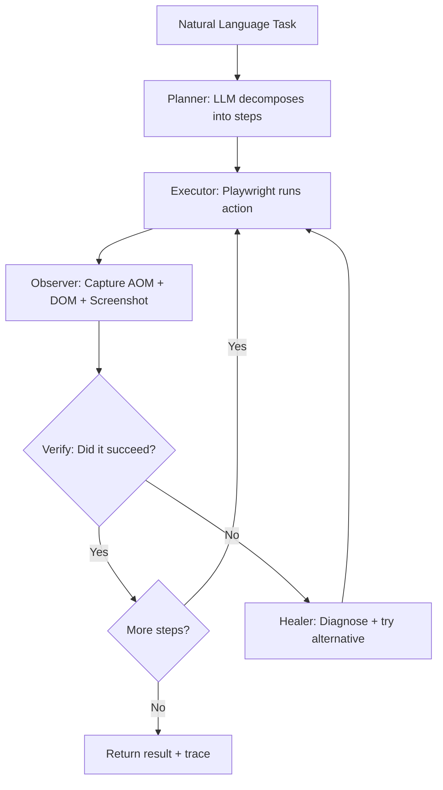

# Phase 2 Task 2: Generalized Browser Automation Agent

Build a self-healing browser automation agent that accepts natural language task descriptions and reliably executes them across diverse websites using a **Planner → Executor → Observer → Healer** loop architecture.

## Key Design Decisions

### Architecture: Observe-Think-Act-Verify Loop


### Locator Strategy: AOM-First 3-Layer Fallback
1. **Layer 1 — Accessibility Tree** (most stable): `role=button, name="Submit"` — survives CSS/class changes
2. **Layer 2 — Semantic DOM**: `aria-label`, `data-testid`, `placeholder`, text content
3. **Layer 3 — Visual/coordinate**: Screenshot analysis for last resort

### Self-Correction (NOT just try/except)
- After each action, **Observer** captures page state (accessibility snapshot + URL + DOM mutations)
- LLM **Diagnoser** classifies failure root cause: `selector_changed`, `page_not_loaded`, `wrong_page`, `element_hidden`, `network_error`
- **Strategy Selector** picks recovery: re-locate element, wait+retry, navigate back, try alternative approach
- Confidence score per step (0-1); below 0.5 triggers Healer automatically

### Self-Maintenance
- **Dynamic locators**: Never hardcode selectors — LLM generates semantic descriptions at runtime
- **Action history**: Record successful patterns per domain for future runs

### Silent Failure Prevention
- **Post-action verification**: After every action, LLM checks "did the intended change actually happen?"
- **Success signal taxonomy**: Click → expect URL/DOM change; Form submit → expect confirmation; Search → expect results

## Proposed Changes

---

### Browser Agent Core

#### [NEW] [agent.py](file:///mnt/c/Users/leoqa/Documents/signal-foundry/src/task2_browser/agent.py)
Main `BrowserAgent` class orchestrating the full loop:
- `run(task_description, target_url, max_steps)` → `AgentResult`
- Manages Playwright browser lifecycle (headless Chromium)
- Runs Observe→Think→Act→Verify loop up to max_steps
- Returns structured trace with every step's action, observation, reasoning, screenshot path

#### [NEW] [planner.py](file:///mnt/c/Users/leoqa/Documents/signal-foundry/src/task2_browser/planner.py)
Task decomposition:
- Takes natural language → produces ordered step plan with predicted failure points
- Uses LLM with system prompt from `prompts/browser_agent/v1_planner.txt`
- Returns `TaskPlan` with steps, each having `action_type`, `target_description`, `success_criteria`

#### [NEW] [executor.py](file:///mnt/c/Users/leoqa/Documents/signal-foundry/src/task2_browser/executor.py)
Playwright action execution with 3-layer locator:
- `execute_action(page, action)` — tries AOM → semantic DOM → text-based fallback
- Wraps all Playwright operations: `click`, `fill`, `select`, `navigate`, `scroll`, `wait`, `extract_text`, `screenshot`
- Captures before/after state diff for every action

#### [NEW] [observer.py](file:///mnt/c/Users/leoqa/Documents/signal-foundry/src/task2_browser/observer.py)
Page state capture and verification:
- `observe(page)` → `PageState` (accessibility tree summary, URL, title, visible text, screenshot)
- `verify_action(before_state, after_state, intended_action)` → `VerificationResult` with confidence score
- Accessibility tree extraction via `page.accessibility.snapshot()`

#### [NEW] [healer.py](file:///mnt/c/Users/leoqa/Documents/signal-foundry/src/task2_browser/healer.py)
Self-healing diagnosis and recovery:
- `diagnose(error, page_state, action)` → `Diagnosis` with root_cause classification
- `suggest_recovery(diagnosis)` → alternative action strategy
- Root cause taxonomy: `selector_changed | page_not_loaded | wrong_page | element_hidden | network_error | captcha_detected | unexpected_popup`

#### [NEW] [schemas.py](file:///mnt/c/Users/leoqa/Documents/signal-foundry/src/task2_browser/schemas.py)
Pydantic models:
- `BrowserAction`, `ActionType` (click, fill, select, navigate, scroll, extract, wait, screenshot)
- `PageState`, `StepResult`, `AgentResult`, `TaskPlan`, `Diagnosis`, `VerificationResult`

---

### Prompts

#### [NEW] prompts/browser_agent/v1_planner.txt
System prompt for task decomposition

#### [NEW] prompts/browser_agent/v1_actor.txt
System prompt for deciding next action from current page state

#### [NEW] prompts/browser_agent/v1_verifier.txt
System prompt for post-action verification

#### [NEW] prompts/browser_agent/v1_healer.txt
System prompt for failure diagnosis and recovery

#### [NEW] prompts/browser_agent/README.md
Version ledger

---

### API & Integration

#### [MODIFY] [router.py](file:///mnt/c/Users/leoqa/Documents/signal-foundry/src/task2_browser/router.py)
Wire skeleton endpoints to real agent:
- `POST /execute` — calls `BrowserAgent.run()`
- `GET /status/{trace_id}` — check running task status
- Returns full execution trace with steps, screenshots, self-corrections

---

### Evaluation

#### [MODIFY] [eval_set.json](file:///mnt/c/Users/leoqa/Documents/signal-foundry/evals/task2/eval_set.json)
Expand to 12+ cases across 4 dimensions:
- Domain: Wikipedia, GitHub, PyPI, HN, httpbin, news sites
- Task type: search+extract, form fill, multi-step navigation, error handling
- Edge cases: cookie banners, 404 errors, dynamic content, popups

#### [NEW] evals/task2/run_eval.py
Automated eval runner

---

### Tests

#### [NEW] tests/test_task2_browser.py
- Schema validation tests
- Planner output format tests
- Observer state capture tests
- Healer diagnosis classification tests
- Integration test with mock page

## Verification Plan

### Automated Tests
```bash
pytest tests/test_task2_browser.py -v
ruff check src/task2_browser/ tests/test_task2_browser.py
```

### Live Smoke Tests
- Wikipedia search + extract (simple)
- httpbin form fill (medium)
- Hacker News multi-step (complex)

### Eval Run
```bash
python -m evals.task2.run_eval --skip-hard
```
