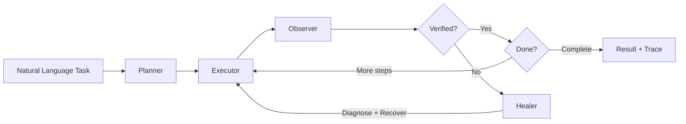

# Phase 2 Task 2 — Browser Automation Agent Walkthrough

## What Was Built

A self-healing browser automation agent that accepts natural language tasks and executes them across diverse websites using **Playwright** with a 4-stage architecture:

## Key Files Created

| Component | File | Purpose |
|-----------|------|---------|
| **Schemas** | [schemas.py](file:///mnt/c/Users/leoqa/Documents/signal-foundry/src/task2_browser/schemas.py) | 13 Pydantic models: ActionType, PageState, StepResult, AgentResult, Diagnosis, etc. |
| **Observer** | [observer.py](file:///mnt/c/Users/leoqa/Documents/signal-foundry/src/task2_browser/observer.py) | Accessibility tree capture, error detection, post-action verification |
| **Executor** | [executor.py](file:///mnt/c/Users/leoqa/Documents/signal-foundry/src/task2_browser/executor.py) | 3-layer AOM-first locator, all browser action types, popup dismissal |
| **Healer** | [healer.py](file:///mnt/c/Users/leoqa/Documents/signal-foundry/src/task2_browser/healer.py) | 9-class root cause taxonomy, deterministic + LLM diagnosis, targeted recovery |
| **Planner** | [planner.py](file:///mnt/c/Users/leoqa/Documents/signal-foundry/src/task2_browser/planner.py) | Task decomposition, reactive next-action, LLM verification |
| **Agent** | [agent.py](file:///mnt/c/Users/leoqa/Documents/signal-foundry/src/task2_browser/agent.py) | Main orchestrator, browser lifecycle, healing loop |
| **Router** | [router.py](file:///mnt/c/Users/leoqa/Documents/signal-foundry/src/task2_browser/router.py) | FastAPI endpoints wired to real agent |
| **Prompts** | [prompts/browser_agent/](file:///mnt/c/Users/leoqa/Documents/signal-foundry/prompts/browser_agent) | 4 versioned prompts + README ledger |
| **Eval Set** | [eval_set.json](file:///mnt/c/Users/leoqa/Documents/signal-foundry/evals/task2/eval_set.json) | 12 real-world cases across 4 dimensions |
| **Eval Runner** | [run_eval.py](file:///mnt/c/Users/leoqa/Documents/signal-foundry/evals/task2/run_eval.py) | Automated scoring with report generation |
| **Tests** | [test_task2_browser.py](file:///mnt/c/Users/leoqa/Documents/signal-foundry/tests/test_task2_browser.py) | 42 tests covering all components |

## Architecture Highlights

### 3-Layer Locator Fallback (NOT hardcoded selectors)
1. **Accessibility Tree** — `page.get_by_role("button", name="Submit")` — survives CSS/class redesigns
2. **Semantic DOM** — `aria-label`, `data-testid`, `placeholder`, `get_by_label()`
3. **Text Content / CSS** — visible text match, then CSS selector as last resort

### Self-Healing (NOT just try/except)
The Healer classifies root cause into 9 categories and selects targeted recovery:
- `unexpected_popup` → dismiss overlay, then retry
- `element_hidden` → scroll to element
- `page_not_loaded` → wait for content
- `wrong_page` → navigate back
- `captcha_detected` → stop (cannot solve)
- `selector_changed` → retry with alternative locators

### Silent Failure Prevention
After every action, the Observer:
1. Compares before/after page state (URL, DOM, accessibility tree)
2. Checks for new error indicators (toasts, alerts, validation messages)
3. Produces a confidence score (0-1); below 0.4 triggers Healer

## Files Modified

| File | Change |
|------|--------|
| [schemas.py](file:///mnt/c/Users/leoqa/Documents/signal-foundry/src/shared/schemas.py) | Added `TOOL_ERROR` to FailureType enum |
| [test_api.py](file:///mnt/c/Users/leoqa/Documents/signal-foundry/tests/test_api.py) | Mocked browser agent to prevent test hangs |

## Verification

- **103/103 tests pass** in 1.31s (42 new Task 2 + 61 existing)
- **0 lint warnings** (ruff check + format)
- **Server starts cleanly** with all routes responding
- Eval set validated: 12 cases, covers easy/normal/hard/edge_case difficulties

## Eval Set Coverage

| Dimension | Cases | Examples |
|-----------|-------|---------|
| Domain diversity | Wikipedia, Google, GitHub, PyPI, HN, SEC EDGAR, Reuters, MDN | Finance, tech, news, government |
| Task complexity | Single-step search, multi-step navigation, form fill, table extraction | Population comparison requires 2 article visits |
| Failure injection | 404 error recovery, cookie banner handling | Graceful degradation |
| Edge cases | SPA routing, dynamic content, complex DOM tables | MDN SPA, GDP table extraction |
